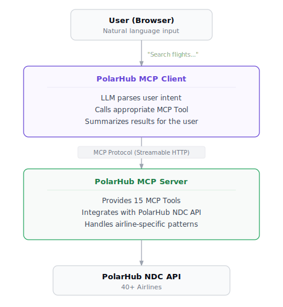
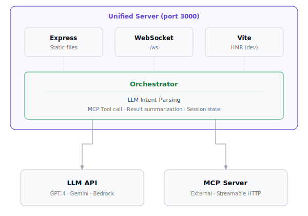

# PolarHub MCP Client

**English** | [한국어](./README.ko.md)

> **"Search flights for me"** — AI-powered airline booking in plain language

An **AI chat client** for NDC (New Distribution Capability) airline booking MCP servers.
Search flights, book tickets, select seats, add services, change itineraries, and process refunds — the entire airline booking lifecycle through natural language conversation.

> **🔗 Links**
>
> | | |
> |---|---|
> | **HaloSync** | [halosync.kr](https://halosync.kr/) |
> | **API Documentation** | [doc.halo-platform.net](https://doc.halo-platform.net/) |

---

## Why This Project?

Airline booking systems are complex. NDC APIs have dozens of endpoints, airline-specific parameters, and multi-step workflows spanning booking → ticketing → modification → refund. Handling this directly requires extensive domain knowledge.

**PolarHub MCP Client hides this complexity behind natural language conversation.**

| Traditional Approach | This Project |
|---------------------|-------------|
| Learn NDC API specs → implement request/response per endpoint | **"Search flights from Seoul to Singapore on April 15"** |
| Manually manage booking state machine (HELD → TICKETED → CANCELLED) | AI manages workflows automatically |
| Write airline-specific exception handling code | MCP server abstracts airline patterns |

### What You Get

- **Ready-to-use airline booking AI chat UI** — Search/book 40+ airlines right after setup
- **MCP protocol reference implementation** — Working code for LLM ↔ MCP server integration
- **Multi-LLM support** — Choose from OpenAI, Gemini, or Bedrock with the same interface
- **Production-grade session management** — State tracking for multi-step booking workflows

---

## Key Concepts

Two concepts to understand before diving in.

### NDC (New Distribution Capability)

An airline distribution standard defined by IATA. It's an XML/JSON-based API specification that enables airlines to directly offer pricing, seats, and ancillary services. PolarHub provides a unified NDC API across 40+ airlines.

### MCP (Model Context Protocol)

A standard protocol proposed by Anthropic for **connecting LLMs to external tools**. When an LLM decides "which Tool to call," the MCP client executes that Tool on the MCP server. This project serves as the MCP client.

```
LLM: "I should call flight_search"
  → MCP Client (this project): Request flight_search Tool execution
    → MCP Server: Call PolarHub NDC API → Return results
```

---

## What Is This Project?

PolarHub MCP Client is a **web client application** that connects to [Model Context Protocol (MCP)](https://modelcontextprotocol.io/)-based airline booking servers.

<p align="center">
  
</p>

**This client does not work without the MCP server.** All functionality is performed by calling Tools provided by the MCP server.

This README is written for **external OTA developers who want to run PolarHub MCP Client or implement the same interaction contract in their own frontend/backend**. It covers not only the demo UI, but also the WebSocket message format, session handoff, and credential pass-through behavior.

---

## Features

### Prime Booking (New Reservations)

| Feature | Description | MCP Tool |
|---------|-------------|:--------:|
| **Flight Search** | Search by origin/destination/date | `flight_search` |
| **Price Confirmation** | Select offer and confirm pricing | `flight_price` |
| **Seat Selection** | Choose seat from seat map | `select_seat` |
| **Add Services** | Select baggage, meals, etc. | `select_service` |
| **Complete Booking** | Enter passenger info and create PNR | `flight_book` |

```
"Seoul to Singapore, April 15, 1 adult"
  → flight_search → flight_price → select_seat → flight_book
```

### Post-Booking (Reservation Management)

| Feature | Description | MCP Tool |
|---------|-------------|:--------:|
| **Order Retrieve** | View booking details by PNR/order ID | `order_retrieve` |
| **Seat Change** | Change seat after booking | `seat_availability` → `order_prepare` → `order_confirm` |
| **Add Services** | Add ancillaries after booking | `service_list` → `order_prepare` → `order_confirm` |
| **Itinerary Change** | Change to different date/flight | `order_reshop` → `order_prepare` → `order_confirm` |
| **Ticketing** | Convert HELD to TICKETED | `order_prepare` → `order_confirm` |
| **Refund** | Cancel and refund booking | `order_reshop` → `order_cancel` |
| **PNR Split** | Separate specific passenger from multi-pax booking | `order_prepare` |
| **Passenger Update** | Modify email, phone, passport, etc. | `order_prepare` |

```
"Change seat to 12A for order ORD_12345"
  → order_retrieve → seat_availability → order_prepare → (confirm) → order_confirm
```

---

## How It Works

Step-by-step breakdown of what happens when a user sends a message.

### Step 1: Intent Parsing

The LLM analyzes natural language to determine **which MCP Tool to call**.

```
User: "Round trip to Singapore, depart April 15, return April 20"
                    ↓
LLM Analysis: tool = "flight_search"
              params = { origin: "ICN", destination: "SIN",
                         departureDate: "2026-04-15", returnDate: "2026-04-20" }
```

The key is **Dynamic Tool Discovery**. Tool definitions aren't hardcoded — they're fetched from the MCP server at startup and used to auto-generate LLM prompts. When new Tools are added to the MCP server, they're automatically available without client changes.

### Step 2: MCP Tool Invocation

The selected Tool is executed on the MCP server via Streamable HTTP transport. PolarHub credentials are passed through as `X-PolarHub-*` HTTP headers.

```
MCP Client → POST /mcp
  Headers: X-PolarHub-Tenant-ID, X-PolarHub-API-Secret, ...
  Body: { method: "tools/call", params: { name: "flight_search", arguments: {...} } }
```

### Step 3: Result Summarization

The LLM summarizes results in natural language (prices with comma separators, 24-hour time format) and delivers them to the user as a text response.

---

## Architecture

<p align="center">
  
</p>

### Core Module Roles

| Module | File | Role |
|--------|------|------|
| **Orchestrator** | `src/orchestrator/index.ts` | Flow control: intent parsing → tool call → summarization → session state |
| **MCP Client** | `src/mcp/client.ts` | MCP server connection, tool calls, static header auth, reconnection |
| **LLM Provider** | `src/llm/provider.ts` | Unified interface for 3 LLM providers + dynamic prompt builder |
| **WebSocket** | `src/server/websocket.ts` | Client session management, message routing, metadata propagation |

### Data Flow

1. **User** → Natural language message (WebSocket)
2. **Orchestrator** → Request LLM intent parsing (which Tool to call?)
3. **LLM** → Return tool name + parameters
4. **MCP Client** → Call Tool on MCP server (Streamable HTTP)
5. **MCP Server** → Call PolarHub NDC API → Return result
6. **Orchestrator** → Request LLM result summarization → Generate user-friendly text
7. **Frontend** → Display text response

---

## Design Principles

Key design decisions that help understand the codebase.

### Dynamic Tool Discovery — No Hardcoded Tool Integration

```typescript
// src/orchestrator/index.ts
const tools = await this.mcpClient.getTools();  // Fetch tool list from MCP server
const prompt = buildIntentParserPrompt(tools);   // Auto-generate LLM prompt from tool descriptions
```

Tool names, parameters, and descriptions all come from the MCP server. When new Tools are added or descriptions change, no client modifications are needed.

### Two-Phase Post-Booking — Query → Preview → Execute

Booking changes always go through **two phases** to prevent mistakes:

```
Query (order_reshop)    → "The change will cost an additional $50"
Preview (order_prepare) → "Proceed with this change?" [Confirm/Cancel]
Execute (order_confirm) → "Change complete!"
```

### Stateful Session — Multi-Step Workflow State Tracking

```typescript
// Context tracked per session by Orchestrator
{
  mcpSessionId: "...",              // Prime Booking session
  postBookingTransactionId: "...",  // Post-Booking transaction
  postBookingOrderId: "...",        // Currently managed order
  lastToolResult: {...},            // Previous tool result (used for next call)
}
```

Session IDs, transaction IDs, and order IDs are automatically extracted from each Tool call result. When a user says "change my seat," the system automatically determines which order and segment from previous context.

---

## WebSocket Protocol

Real-time communication specification between frontend and backend.

### Client → Server

```typescript
// Natural language message
{ type: "user_message", id: "uuid", content: "Search flights", timestamp: 1234567890 }

// Recommended: action message (used by the bundled frontend)
{ type: "action", id: "uuid", action: "SelectOffer", payload: { sessionId: "sess_xxx", offerIndex: 1 }, transactionId: "client_tx_1" }

// Recommended: completed forms are also sent as action messages
{ type: "action", id: "uuid", action: "SubmitPassengers", payload: { sessionId: "sess_xxx", passengers: [...], contact: {...} }, transactionId: "client_tx_1" }

// Legacy compatibility: form_submit is still accepted by the server
{ type: "form_submit", id: "uuid", formType: "passenger", data: { passengers: [...] }, transactionId: "client_tx_1" }
```

### Server → Client

```typescript
// Connection established
{ type: "connection", status: "connected", sessionId: "sess_abc" }

// AI response (text + structured payload)
{ type: "assistant_message", id: "uuid", content: "Here are the results.", toolResult: {...}, metadata: {...} }

// Tool call start/end (for loading indicators)
{ type: "tool_call_start", id: "uuid", toolName: "flight_search" }
{ type: "tool_call_end",   id: "uuid", toolName: "flight_search", success: true }

// Error
{ type: "error", id: "uuid", code: "MCP_ERROR", message: "Server connection failed" }
```

Integration notes:

- `transactionId` in the WebSocket payload is a **client-side conversation correlation ID**. It is separate from the MCP post-booking `transactionId`.
- The bundled frontend sends most user interactions as `action` messages. If you build your own client, this is the recommended path.
- `assistant_message.metadata` may include follow-up identifiers such as `sessionId`, `orderId`, `transactionId`, and `refundQuoteId`, so you should **persist it per conversation session**.
- `assistant_message.toolResult` is the raw MCP `structuredContent`, which is useful for custom UI rendering and debugging.

---

## Quick Start

### Prerequisites

- **Node.js** >= 18
- **PolarHub MCP Server** Endpoint and credentials
- **LLM API Key** (choose one)
  - OpenAI API Key (`sk-...`)
  - Google Gemini API Key
  - Bedrock API Key (`BEDROCK_API_KEY`, Bearer token auth)

### Installation & Run

```bash
# 1. Install dependencies
npm install

# 2. Configure environment
cp .env.example .env
```

Edit the `.env` file:

```bash
# LLM provider (choose: openai / gemini / bedrock)
LLM_PROVIDER=gemini
GEMINI_API_KEY=your-gemini-api-key-here

# MCP server endpoint
MCP_SERVER_URL=https://mcp.sandbox.halo-platform.net/mcp

# PolarHub credentials (required — request from admin)
POLARHUB_TENANT_ID=your-tenant-id
POLARHUB_API_SECRET=your-base64-secret
```

```bash
# 3. Build
npm run build

# 4. Run in development mode
npm run dev
```

Open **http://localhost:3000** in your browser

### Health Check

```bash
curl http://localhost:3000/health
# { "status": "ok", "mode": "development" }
```

> **Note**: The `.env` file is included in `.gitignore` and will not be committed. Never push your `.env` file to Git.

### OTA Integration Checklist

- Keep one WebSocket connection per browser/app conversation.
- Persist `assistant_message.metadata` and reuse it for follow-up actions in the same conversation.
- Send user interactions and completed form events as `action` messages whenever possible.
- Never place PolarHub secrets in the browser; inject them only through this server's environment variables.

---

## Environment Variables

### Required

| Variable | Description | Example |
|----------|-------------|---------|
| `LLM_PROVIDER` | LLM provider | `openai`, `gemini`, `bedrock` |
| `MCP_SERVER_URL` | MCP server endpoint | `https://mcp.sandbox.halo-platform.net/mcp` |
| `POLARHUB_TENANT_ID` | Agency/Tenant ID | (request from admin) |
| `POLARHUB_API_SECRET` | API secret (Base64) | (request from admin) |

### Per LLM Provider

| Variable | Provider | Description |
|----------|:--------:|-------------|
| `OPENAI_API_KEY` | OpenAI | API key (`sk-...`) |
| `OPENAI_MODEL` | OpenAI | Model name (default: `gpt-4-turbo-preview`) |
| `GEMINI_API_KEY` | Gemini | API key |
| `GEMINI_MODEL` | Gemini | Model name (`gemini-2.0-flash`, `gemini-3-flash-preview`, etc.) |
| `BEDROCK_API_KEY` | Bedrock | Bearer token for the Bedrock Converse API |
| `AWS_REGION` | Bedrock | AWS region |
| `BEDROCK_MODEL` | Bedrock | Model ID |

> Note: `.env.example` uses `GEMINI_MODEL=gemini-2.0-flash` as the sample value, while the runtime fallback in code is `gemini-3-flash-preview` if the variable is omitted entirely.

### Optional

| Variable | Default | Description |
|----------|---------|-------------|
| `PORT` | `3000` | Server port |
| `DEBUG_PROMPTS` | `false` | Print LLM prompts to console |

---

## MCP Server Authentication

This client passes PolarHub credentials as static HTTP headers to the MCP server.
The browser never needs direct access to PolarHub secrets; the **Node server reads them from environment variables and forwards them server-to-server**.

```text
X-PolarHub-Tenant-ID: {tenantId}
X-PolarHub-API-Secret: {base64_secret}
```

---

## Onboarding & Credentials

You need a PolarHub NDC platform account to run this client.

### How to get access

Send an onboarding request to **contact@halosync.kr** with your company name and use case. The team will issue your Sandbox credentials.

> Automated self-service onboarding is currently in progress.

### Required credentials

| Required | Description | How to Get |
|----------|-------------|------------|
| `POLARHUB_TENANT_ID` | Agency identifier | Issued after onboarding |
| `POLARHUB_API_SECRET` | API secret (Base64) | Issued after onboarding |

> The Sandbox environment is for testing only — no real flight bookings are made.
>
> [HaloSync](https://halosync.kr/) &nbsp;|&nbsp; [API Docs](https://doc.halo-platform.net/)

---

## Project Structure

```
polarhub-mcp-client/
├── src/                          # Bridge server (Node.js + TypeScript)
│   ├── index.ts                  # Entry point — server startup, MCP connection (5 retries)
│   ├── config/                   # Environment variable parsing + validation
│   ├── llm/                      # LLM provider abstraction
│   │   ├── provider.ts           # Common interface + dynamic prompt builder
│   │   ├── openai.ts             # OpenAI (Function Calling)
│   │   ├── gemini.ts             # Google Gemini (schema sanitization included)
│   │   └── bedrock.ts            # AWS Bedrock (Bearer Token, direct HTTP calls)
│   ├── mcp/
│   │   └── client.ts             # MCP client — Streamable HTTP + static header auth + reconnection
│   ├── orchestrator/
│   │   └── index.ts              # Core engine — intent parsing → tool call → summarization → state mgmt
│   ├── server/
│   │   ├── http-server.ts        # Express (static files) + Vite (HMR, dev mode)
│   │   └── websocket.ts          # WebSocket session management + metadata propagation
│   └── shared/
│       └── types/messages.ts     # Client↔Server message type definitions
├── packages/
│   ├── frontend/                 # React web app
│   │   └── src/
│   │       ├── components/
│   │       │   ├── chat/         # ChatContainer, ChatInput, ChatMessage
│   │       │   └── layout/       # Header, Sidebar, MainLayout
│   │       └── store/            # Zustand state management
│   │           ├── chatStore.ts          # WebSocket connection + message state
│   │           └── conversationStore.ts  # Conversation history (localStorage persistence)
├── package.json                  # npm workspaces root
├── tsconfig.json
├── .env.example                  # Environment variable template (dummy values)
└── .gitignore                    # Includes .env — prevents secret commits
```

### Build Order

```
frontend → src/ (backend TypeScript compilation)
```

`npm run build` handles this order automatically.

---

## Tech Stack

| Layer | Technology |
|-------|-----------|
| **Frontend** | React 18, Vite, Tailwind CSS, Zustand |
| **Backend** | Node.js, Express, TypeScript |
| **WebSocket** | ws (real-time bidirectional communication) |
| **MCP Client** | @modelcontextprotocol/sdk (Streamable HTTP) |
| **LLM** | OpenAI GPT-4 / Google Gemini / AWS Bedrock |
| **Styling** | Halo Design System (halo-purple, halo-green tokens) |

---

## Scripts

| Command | Description |
|---------|-------------|
| `npm run dev` | Development mode (tsx watch + Vite HMR) |
| `npm run build` | Full build (frontend → bridge) |
| `npm start` | Production mode |
| `npm run clean` | Clean build artifacts |

---

## Language Support (i18n)

The client supports **English** and **Korean**. The language is auto-detected from the browser and applied to both the UI and LLM responses.

### How It Works

1. Browser language (`navigator.language`) is detected on page load
2. The locale is passed to the server via WebSocket
3. System prompts and LLM responses adapt to the detected language

### Switching to English

**Option A — Browser language**: Change your browser language to English in Chrome → Settings → Languages → move English to the top.

**Option B — URL parameter**: Append `?locale=en` to the URL:
```
http://localhost:3000/?locale=en
```

**Option C — Environment variable**: Set the server default in `.env`:
```
DEFAULT_LOCALE=en
```

> The priority is: URL parameter > Browser language > `DEFAULT_LOCALE` env var.

**Note:** The response language is determined by the locale setting, not the input language. If you type in Korean with `locale=en`, the AI will still respond in English (and vice versa).

---

## Debugging

### Check LLM Prompts

To inspect system prompts sent to the LLM:

```bash
DEBUG_PROMPTS=true npm run dev
```

Intent Parser / Result Summarizer prompts will be printed to the console.

### Verify MCP Server Connection

```bash
# MCP server health check
curl http://localhost:8000/health
# { "status": "ok", "transport": "streamable-http" }

# This client health check
curl http://localhost:3000/health
# { "status": "ok", "mode": "development" }
```

### Common Issues

| Symptom | Cause | Solution |
|---------|-------|----------|
| `MCP connection failed` repeating | MCP server not running or wrong URL | Check `MCP_SERVER_URL`, verify MCP server status |
| `LLM API key missing` | Environment variable not set | Set the API key matching your `LLM_PROVIDER` in `.env` |
| `Authentication failed` | Invalid credentials | Verify `POLARHUB_TENANT_ID` and `POLARHUB_API_SECRET` |
| WebSocket disconnection | Server restart or network issue | Refresh browser (auto-reconnect attempted) |

---

## Demo Videos

### Prime Booking — Flight Search → Booking Complete (SQ)

The full flow of searching flights with natural language, selecting an offer, entering passenger details, and completing the booking.

https://github.com/user-attachments/assets/3395f378-88f2-4ff7-a340-2dc439a67570


### Post-Booking — Order Retrieve → Seat Change (EK)

Retrieving an existing booking, viewing the seat map, changing the seat, and re-verifying the order.

https://github.com/user-attachments/assets/2b0d7d4e-305a-475d-bddd-8467fd5d09d7


> Videos are edited at 3x speed from actual demos.

---

## Usage Examples

### Flight Search + Booking

```
User: Search flights from Seoul to Singapore, April 15, 1 adult
→ AI displays available flight options with prices and schedules

User: "Select the 2nd offer"
→ AI shows fare breakdown details

User: I'd like to select a seat too
→ AI presents available seats

User: "Seat 12A please"
→ AI requests passenger information

User: (provides passenger details)
→ AI confirms booking complete with PNR
```

### Reservation Management

```
User: Retrieve order ORD_12345
→ AI shows booking status, itinerary, and passenger info

User: I want to change to seat 15C
→ AI checks availability → shows price difference → confirms change

User: How much would a refund be for this booking?
→ AI shows refund amount details

User: Proceed with the refund
→ AI processes and confirms the refund
```

---

## Supported Airlines

The MCP server supports the following airlines via the Sandbox PolarHub NDC API.

Verified airlines:

| Airline | Code | Prime Booking | Post-Booking |
|---------|:----:|:---:|:---:|
| Singapore Airlines | SQ | O | O |
| Finnair | AY | O | O |
| Air France | AF | O | O |
| KLM | KL | O | O |
| Emirates | EK | O | O |
| Lufthansa | LH | O | - |
| Turkish Airlines | TK | O | O |
| Scoot | TR | O | O |
| Hawaiian Airlines | HA | O | O |
| Qatar Airways | QR | O | - |
| British Airways | BA | O | - |

---

## License

MIT License — See [LICENSE](./LICENSE)
